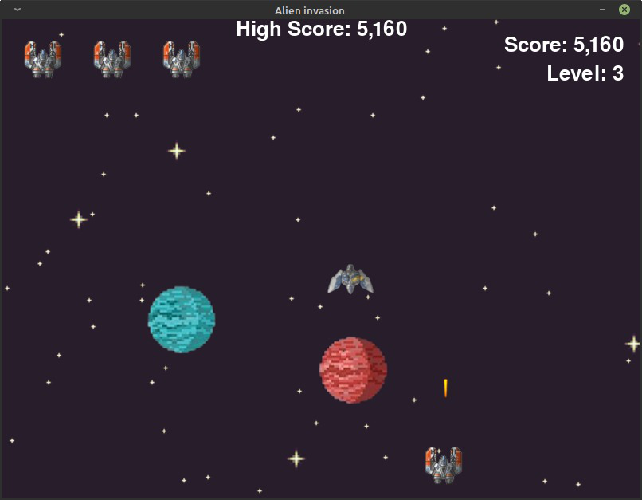

# ALIEN INVASION
## Jogo feito usando a biblioteca pygame do Python
Livro de referência: Python Crash Course: A Hands-On, Project-Based Introduction to Programming.

## Executando o jogo!
1. Precisamos ter instalado a biblioteca pygame na máquina:
> pip install pygame
2. Execute o arquivo alien_invasion.py
